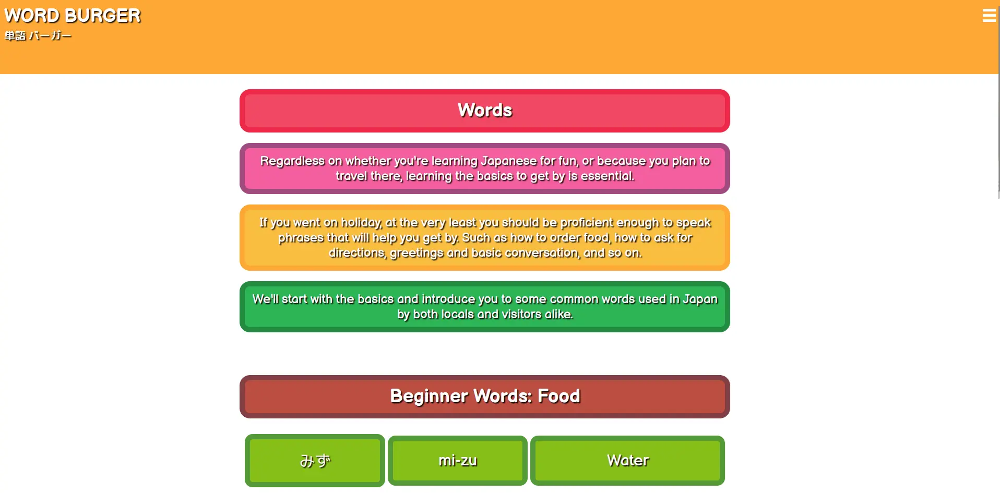

# [WORD BURGER](https://code-lau.github.io/Word_Burger)

Word Burger is an app that aims to help users practise and learn the Japanese alphabet, Hiragana, Katakana and Kanji. 

Here is a demonstration of responsiveness, done through [Am I Responsive?](https://ui.dev/amiresponsive?url=https://code-lau.github.io/Word_Burger/)

## UX
This is not a commercial site and as such doesn't need commercial features such as hero sections. The app was designed with a younger audience in mind, and as such I adopted a colourful design scheme. The design is based off a burger and works better when viewed as a mobile app. The header and footer are meant to represent the buns, and the page content represents the ingredients. (The meat of the matter, if you will.)

### Colour Scheme

The colours were chosen with readability and keeping interest in mind, each main colour representing a specific ingredient of a generic burger. The top of the bun, tomatoes, red onions, cheese, pickles, burger patty, lettuce and the bottom of the bun, in that order. The colours are as follows:

- `#FEA836` used for the header and footer
- `#F04863` used for the tomato containers
- `#F02949` used for the tomato container outlines
- `#F45F9F` used for the red onion containers
- `#A14A81` used for the red onion container outlines
- `#FDC756` used for the cheese containers
- `#FEA836` used for the cheese container outlines
- `#2DB455` used for the pickle containers
- `#238A41` used for the pickle container outlines
- `#BC4D41` used for the burger containers
- `#824044` used for the burger container outlines
- `#87BF18` used for the lettuce containers
- `#549A38` used for the lettuce container outlines

As some colours like the burger buns and cheese are lighter, legibility is a concern. I chose darker variants and added shadows to the text to allow the user to more clearly read the text. 

### Typography

The font primarily used on this website is [Balsamiq Sans](https://fonts.google.com/specimen/Balsamiq+Sans). I chose this for the easy legibility and childlike educational theme to it. For the Japanese characters, I used [M PLUS Rounded 1c](https://fonts.google.com/specimen/M+PLUS+Rounded+1c?query=M+PLUS+Rounded+1c). This was the best font that matched Balsamiq Sans and also allowed the use of the Japanese characters. 

The social icons are used from [Font Awesome](https://cdnjs.cloudflare.com/ajax/libs/font-awesome/6.5.2/css/all.min.css).

## Features

### Existing Features

**Logo**
- The logo contains the title and when clicked, returns the user to the home page. This was implemented to give the users an ease of access with navigation if they are unfamiliar with the navigation menu. The title, "Word Burger" is in english, with the same being written beneath it in Japanese, "単語 バーガー". This title would be excluded from all translations because ideally, this would be trademarked. 

**Navigation Menu**
- The navigation menu features all the main pages the user would be interested, which includes: the home page, the hiragana page, the katakana page, the kanji page, the tests page and the words page. After the words page link is the, site language dropdown menu. This menu is within the navigation menu as a standalone dropdown menu, containing language options for the user to select. The languages available are: English, French, Spanish, German, Portuguese, Russian and Chinese. When any of these are clicked, the page reloads with the respective langauge applies to all text available, excluding the logo. This also includes the navigation menu itself.

**Guide Buttons**
- On the home page I created buttons with the main navigation links the user would be interested in. This includes the hiragana, katakana, kanji, word and tests pages. This was implemented to save the user time, they can find what they are interested in within seconds of loading the home page. This holds their interest and prevents them from getting lost should they not understand how to use the navigation menu. 

**Socials**
- At the bottom of the page are three icons that link to the hypothetical respective social medias associated with Word Burger. As this is not a real app or company, these links don't actually exist. For the purpose of demonstration, all anchors link to their respective websites.

**The Hiragana Page**
- This page holds information about hiragana and the characters included within it. The page contains a brief introduction to Hiragana as a concept and explains how many characters there are along with the differences. All characters are displayed alongside their romanji/latin letter counterparts for the user to study. Beneath that is a table that contains all the flashcard quizzes related to hiragana.

**The Katakana Page**
- This page is near identical in format and introduction to the hiragana page, with key differences that explain the difference to the user. This page also features an introduction to the characters, the characters themselves and a table containing flashcard quiz links related to Katakana.

**The Kanji Page**
- The kanji page is similar to the hiragana and katakana pages in that it gives a brief introduction to Kanji, followed by some characters for the user to study. Currently there is no quizzes for kanji, but there may be in the future.

**The Words Page**
- The words page displays some common and beginner friendly words for the user to study.

**The Tests Page**
- The tests page displays a complete list of all available tests to the user. This includes quizzes only containing hiragana characters, quizzes containing only katakana characters, and both.

**The Error Page**
- This page is a failsafe to help users navigate back to the home menu should there be an issue with connecting them to the right page.

### Future Features

**More Content**

- I would like to add more words and kanji for the user to study

**More Quizzes**

- I would like to add quizzes for kanji and words.

**Scoreboard**

- I would like to add a leaderboard in the future that allows the user to simply keep track of how well they did on certain quizzes and tests.

**Quiz Variations**

- Currently all the quizzes adopt the flashcard study quiz type, in the future I would like to add different quiz formats to allow for more accessibilty to users. By letting the user choose how they want to study, they can learn more effectively.

**Sharing Results**

- I would like to add a feature that allows the user to copy an image of the results they got on a test or quiz so they can share it with their friends.

**More Languages**

- In production, Hindi was initially planned and then cut due to difficulties. In the future, I would like to have as many langauges as possible as options.

## Tools & Technologies Used
For this project, I used gitpod and Visual Studio Code to code in. Github was used to host the repository, Github Pages for the deployment. The main site content was written with HTML, the designs with CSS and the quiz functionality with Javascript. Any images used were put through TinyPng and Webp Converter to reduce the size and convert them to Webp files. The website was originally designed in Figma, although I didn't end up going with said design. Font Awesome was used for all social icons and down arrows. This template along with the template for the TESTING.md file were generated with the Markdown Builer.

-  used to generate README and TESTING templates.
-  used for version control. (`git add`, `git commit`, `git push`)
-  used for secure online code storage.
-  used as a cloud-based IDE for development.
-  used for the main site content.
-  used for the main site design and layout.
-  used for user interaction on the site.
-  used for hosting the deployed front-end site
-  used for creating wireframes.
-  used for the icons.
-  used for translations.
-  used for translations.

## Testing
For testing, please refer to the [TESTING.md](TESTING.md) file.

## Deployment

The site was deployed to GitHub Pages.

### Local Deployment

This project can be cloned or forked in order to make a local copy on your own system.

#### Cloning

You can clone the repository by following these steps:

1. Go to the [GitHub repository](https://github.com/Code-Lau/Word_Burger) 
2. Locate the Code button above the list of files and click it 
3. Select if you prefer to clone using HTTPS, SSH, or GitHub CLI and click the copy button to copy the URL to your clipboard
4. Open Git Bash or Terminal
5. Change the current working directory to the one where you want the cloned directory
6. In your IDE Terminal, type the following command to clone my repository:
	- `git clone https://github.com/Code-Lau/Word_Burger.git`
7. Press Enter to create your local clone.

Alternatively, if using Gitpod, you can click below to create your own workspace using this repository.

Please note that in order to directly open the project in Gitpod, you need to have the browser extension installed.
A tutorial on how to do that can be found [here](https://www.gitpod.io/docs/configure/user-settings/browser-extension).

#### Forking

By forking the GitHub Repository, we make a copy of the original repository on our GitHub account to view and/or make changes without affecting the original owner's repository.
You can fork this repository by using the following steps:

1. Log in to GitHub and locate the [GitHub Repository](https://github.com/Code-Lau/Word_Burger)
2. At the top of the Repository (not top of page) just above the "Settings" Button on the menu, locate the "Fork" Button.
3. Once clicked, you should now have a copy of the original repository in your own GitHub account!

### Local VS Deployment

After testing both the local version hosted by Gitpod, and the live version hosted by GitHub Pages I observed no notable differences. This was tested on Firefox.

## Credits 
All code referenced does not belong to me, and is borrowed expressly for learning purposes.
| Source | Content | Location |
| --- | --- | --- |
| [Hard Coded Questions](https://www.youtube.com/watch?v=zZdQGs62cR8&list=PLDlWc9AfQBfZIkdVaOQXi1tizJeNJipEx&index=4) | Help with question arrays | Youtube |
| [Display Feedback](https://www.youtube.com/watch?v=_LYxkClHnV0&list=PLDlWc9AfQBfZIkdVaOQXi1tizJeNJipEx&index=5) | Help with correct/incorrect answers | Youtube |
| [Score Increment](https://www.youtube.com/watch?v=BOQLbu_Crc0&list=PLDlWc9AfQBfZIkdVaOQXi1tizJeNJipEx&index=6) | Help with score increment and progress bad | Youtube |
| [Game Choices Format](https://www.youtube.com/watch?v=IK257Ln0MZc&list=PLDlWc9AfQBfZIkdVaOQXi1tizJeNJipEx&index=4) | Help with question and answer format | Youtube |
| [ChatGPT](https://chatgpt.com/) | Help with game script| ChatGPT |
| [Building a Multilingual Static Website](https://medium.com/@nohanabil/building-a-multilingual-static-website-a-step-by-step-guide-7af238cc8505)| Help with making the website multilingual | Medium |

## Content
| Source | Content | Not |
| --- | --- | --- |
| [Wikipedia](https://www.wikipedia.org/) | Hiragana, Katakana and Kanji characters | All characters can be found on wikipedia. |
| [DeepLTranslator](https://www.deepl.com/en/translator) | Translations | All translations was made using the DeepL Translator tool alongside other online dictionaries. |
| [Collins Dictionary](https://www.collinsdictionary.com/) | Specific word translations | The Collins Dictionary was used to double check translations and search for specific words that the DeepL Translator tool may have missed. |

## Media
No images were used for this project beyond the favicon, which is an image I created in photoshop using my own text tool.

## Acknowledgements
- I would like to thank my (very cool) Code Institute mentor, [Tim Nelson](https://github.com/TravelTimN) for his support throughout the development of this project.
- I would like to thank the [Code Institute](https://codeinstitute.net) tutor team for their assistance with troubleshooting and debugging some project issues.
- I would like to thank my family for help with user testing and UX advice.
