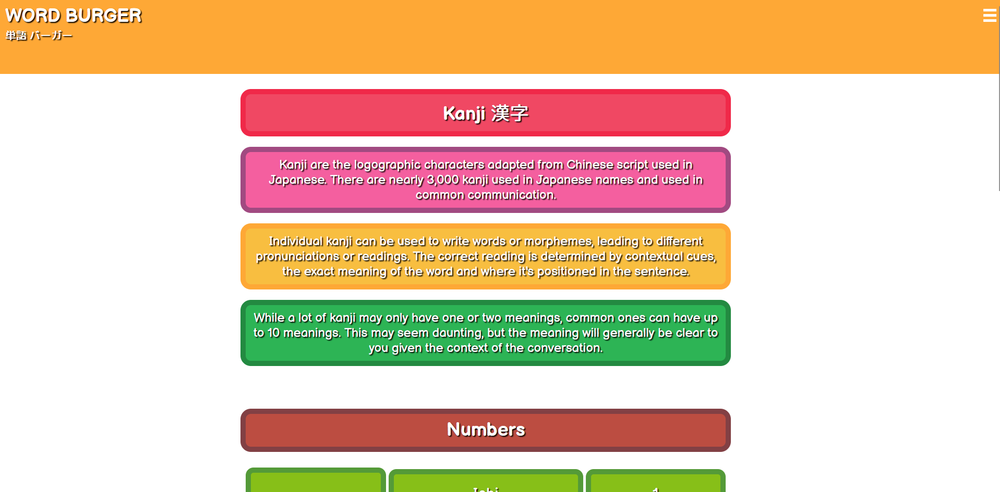
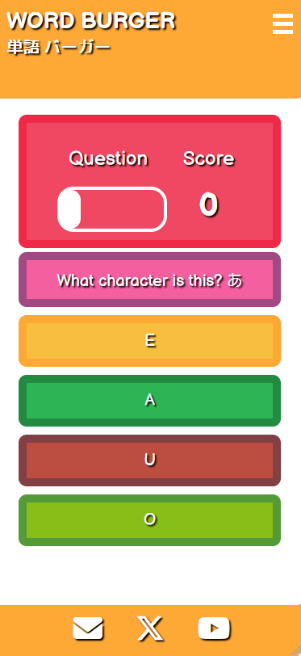

# Testing

> Return back to the [README.md](README.md) file.

## Code Validation

All files were put the their respective validators, and came back with no errors.

**HTML**

For all HTML files, I used [HTML W3C Validator.](https://validator.w3.org/)

- Home Page

- Hiragana Page

- Katakana Page

- Kanji Page

- Words Page

- Tests Page

- Error Page

- Hiragana Game Page

- Katakana Game Page

- All Letters Game Page

- Quiz End Page

**CSS**

For the style sheet, I used the [CSS Jigsaw Validator](https://jigsaw.w3.org/css-validator/)

- Style sheet

**Javascript**

For the javascript files, I used the [JShint Validator](https://jshint.com/)

- Burgermenu Script

- Game Script (For Hiragana and Katakana seperately)

- All Letters Script (For both Hiragana and Katakana together)

- Language Script

- Hiragana Letters Script

- Katakana Letters Script

- All Letters Script

## Responsiveness

### Home Page

| Desktop | Tablet | Mobile |
| --- | --- | --- |
|  |  |  |

### Hiragana Page

| Desktop | Tablet | Mobile |
| --- | --- | --- |
|  |  |  |

### Katakana Page 

| Desktop | Tablet | Mobile |
| --- | --- | --- |
|  |   |  |

### Kanji Page

| Desktop | Tablet | Mobile |
| --- | --- | --- |
|  |  |  |

### Words Page

| Desktop | Tablet | Mobile |
| --- | --- | --- |
|  |  |  |

### Tests Page

| Desktop | Tablet | Mobile |
| --- | --- | --- |
|  |  |  |

### Quiz Page

| Desktop | Tablet | Mobile |
| --- | --- | --- |
|  |  |  |

### Quiz End Page

| Desktop | Tablet | Mobile |
| --- | --- | --- |
|  |  |  |

### Error Page

| Desktop | Tablet | Mobile |
| --- | --- | --- |
|  |  |  |

## Compatibility Testing

Here I manually tested all functionality and features across all responsive sizes and browsers. For this, I used Chrome, Opera, Firefox and Edge.

**Firefox**

**Chrome**

**Opera**

**Edge** 

