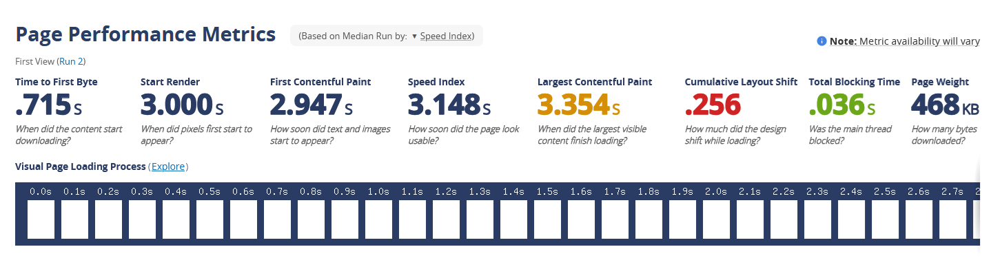

# Testing

> Return back to the [README.md](README.md) file.

## Code Validation

All files were put the their respective validators, and came back with no errors.

### HTML

For all HTML files, I used [HTML W3C Validator.](https://validator.w3.org/) For some of these files, it comes back with warnings, stating that I have empty h2 tags or similar. This is done on purpose as I was using the data-i18n tag to translate text. I am aware of these warnings but don't consider them issues.

Home Page

Hiragana Page

Katakana Page

Kanji Page

Words Page

Tests Page

Error Page

Hiragana Game Page

Katakana Game Page

All Letters Game Page

Quiz End Page

### CSS

For the style sheet, I used the [CSS Jigsaw Validator.](https://jigsaw.w3.org/css-validator/)

**Style sheet**

### Javascript

For the javascript files, I used the [JShint Validator.](https://jshint.com/) For the "letters" files, they claim to have many unused variables, but this is only true within the file itself. In the case of the website, these files are being called upon in conjunction with the game scripts, and are used on the html game pages.

Burgermenu Script

Game Script (For Hiragana and Katakana seperately)

All Letters Game Script (For both Hiragana and Katakana together)

Language Script

Hiragana Letters Script

Katakana Letters Script

All Letters Script

## Responsiveness

### Home Page

| Desktop | Tablet | Mobile |
| --- | --- | --- |
|  |  |  |

### Hiragana Page

| Desktop | Tablet | Mobile |
| --- | --- | --- |
|  |  |  |

### Katakana Page 

| Desktop | Tablet | Mobile |
| --- | --- | --- |
|  |   |  |

### Kanji Page

| Desktop | Tablet | Mobile |
| --- | --- | --- |
|  |  |  |

### Words Page

| Desktop | Tablet | Mobile |
| --- | --- | --- |
|  |  |  |

### Tests Page

| Desktop | Tablet | Mobile |
| --- | --- | --- |
|  |  |  |

### Quiz Page

| Desktop | Tablet | Mobile |
| --- | --- | --- |
|  |  |  |

### Quiz End Page

| Desktop | Tablet | Mobile |
| --- | --- | --- |
|  |  |  |

### Error Page

| Desktop | Tablet | Mobile |
| --- | --- | --- |
|  |  |  |

## Compatibility Testing

Here I manually tested all functionality and features across all responsive sizes and browsers. For this, I used Chrome, Opera, Firefox and Edge.

**Firefox**

**Chrome**

**Opera**

**Edge** 

## Lighthouse Tests

I ran a lighthouse test for the home page and the game page to test the performance of the website.

| Home | Quiz |
| :---: | :---: |
|  |  |

## Manual Testing

| Test | Goal | Outcome |
| --- | --- | --- |
| Responsiveness | Website should be responsive to all screen sizes | Passed |
| Logo | The logo should redirect the user to the home page if clicked | Passed |
| Nav Menu | All navigational links should direct the user to the intended source | Passed |
| Buttons | All buttons should function to answer questions | Passed |
| Score | Score should increase upon answering a question correctly | Passed |
| Language | The language should change to the respective choice when instructed to | Passed |
| Progress Bar | The progress bar should increase regardless of the answer being correct | Passed |
| Social Icons | All social icons should open a separate tab to the appropriate social media | Passed |

## Site Speed Tests

For this, I used [Catchpoint's Site Performance Service.](https://www.webpagetest.org/) This allows you to test site performance, speed, core web vitals and visual comparisons on all devices.

### Device Compatibilty 

For device compatibilty I tested the following devices:
- Two desktop computers using Firefox and Chrome respectively

- ASUS Notebook PC using Chrome 

- Samsung Galaxy S20 FE

- Samsung Galaxy A12

- Samsung Galaxy M12

- Samsung Galaxy A03

All of these devices had no issues running the site or interacting with features.
    
### User Experience Testing

- I asked some family and friends to load the website on their devices and to test anything that seemed like it was interactable. The feedback was unanimous in that there were no issues.
- The design was clear and easy to understand, they had no issue navigating the site or information presented. 
- They offered some suggestions for design and content that I hope to implement in the future.

### User Feedback Incorporation:
Some suggestions for features I have taken on board include 
- Recommended colours
- "A" character favicon

### Bugs
There are no remaining bugs that I'm aware of.